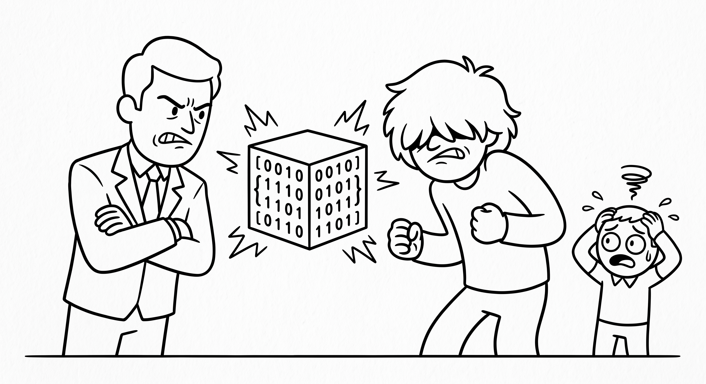

# Chaos Coding Agents



Two AI agents argue over your codebase. One rewrites it. The other rewrites the rewrite. A third agent explains the mess when you get back.

Built as a LangGraph multi-agent system — a state graph replaces a hand-rolled turn loop, with agent nodes, a routing function, and a stream observer driving terminal output, TTS, and OBS portrait switching.

---

## How It Works

```
You speak or type a feature request
         │
         ▼
┌─────────────────────────────────────────────────────────────┐
│                      TURN LOOP (N rounds)                   │
│                                                             │
│   ┌─────────────┐   reads workspace   ┌─────────────────┐   │
│   │  EDGEWORTH  │ ◄────────────────── │   workspace/    │   │
│   │  (precise,  │                     │   solution.py   │   │
│   │  cold)      │ ──── writes code ──►│                 │   │
│   └──────┬──────┘                     └─────────────────┘   │
│          │ critique                          │              │
│          ▼                                   │              │
│   ┌─────────────┐   reads workspace          │              │
│   │    LIGHT    │ ◄──────────────────────────┘              │
│   │  (chaotic,  │                                           │
│   │  defensive) │ ──── rewrites ──────────────┐             │
│   └──────┬──────┘                             │             │
│          │ critique                           ▼             │
│          └──────────────── repeat ◄── workspace/solution.py │
└─────────────────────────────────────────────────────────────┘
         │
         │  (N rounds complete)
         ▼
┌─────────────────────────────────────────────────────────────┐
│                    THE INTERN                               │
│   Reads final codebase. Panics. Summarizes what was         │
│   actually built vs. what you asked for.                    │
└─────────────────────────────────────────────────────────────┘
```

This loop is a LangGraph `StateGraph`: `edgeworth` and `light` are nodes, a conditional
edge (`should_continue`) decides whether to loop back to `edgeworth` or move on to
`intern`, and `intern` connects to `END`. See `graph.py`.

### Message flow between agents

Each agent receives a **context package** on their turn — this is the core of multi-agent coordination:

```
┌──────────────────────────────────────┐
│           Context Package            │
│                                      │
│  • Original feature request          │
│  • Current codebase (all .py files)  │
│  • Previous agent's critique         │
│  • Round number                      │
└──────────────────────────────────────┘
         │
         ▼
   Agent reads it, writes new code + critique
         │
         ▼
   Code → written to workspace/<session_id>/solution.py
   Critique → passed to next agent's context package
```

Each agent also maintains its own **conversation history** in LangGraph state
(`edgeworth_history` / `light_history`, accumulated via the `add_messages` reducer) —
so Edgeworth remembers everything he's written, and Light remembers everything he's
written, but they don't share the same thread.

---

## Feature Drift

From round 3 onward, both agents are instructed they may add unrequested functionality:

- **Edgeworth** adds abstraction layers, design patterns, and architecture that wasn't asked for — because he considers the original request beneath proper engineering
- **Light** adds chaotic bonus features mid-rewrite and announces them as obvious improvements

The Intern's summary explicitly calls out what you asked for vs. what was actually built.

---

## Getting Started

**1. Create the environment**
```bash
mamba env create -f environment.yml
mamba activate chaos-agents
```

**2. Set your API key**
```bash
export ANTHROPIC_API_KEY=your_key_here
```

**3. Run**
```bash
python main.py --rounds 2
```

**CLI options**
```bash
python main.py --rounds 3          # shorter/longer loop
python main.py --voice              # per-agent TTS via Mac `say`
python main.py --voice --elevenlabs  # TTS via ElevenLabs instead
python main.py --obs                # OBS portrait switching per agent turn
```

Each run creates `workspace/<session_id>/solution.py`, the file both agents read from
and rewrite each round — printed at startup so you can find it afterward.

---

## Project Structure

```
ChaosCodingAgents/
│
├── state.py                   CCAState — the graph's shared state schema.
│
├── nodes.py                   edgeworth_node, light_node, intern_node.
│
├── graph.py                   Graph wiring: nodes, edges, should_continue routing.
│
├── main.py                    CLI entry point, initial state, stream observer
│                               (terminal output, TTS, OBS, file persistence).
│
├── agents.py                  System prompts for Edgeworth, Light, and the Intern,
│                               plus their drift directives (round 3+).
│
├── context_builder.py         Formats the context package passed between agents.
│
├── workspace_manager.py       Writes each round's code to workspace/<session>/solution.py.
│
├── voice.py                   TTS via Mac `say` or ElevenLabs (per-agent voices),
│                               microphone recording, and speech-to-text.
│
├── obs_manager.py             OBS WebSocket connection — show/hide agent portraits.
│
├── terminal_ui.py             Terminal colors, banners, and critique-block printing.
│
├── config.py                  All tuneable constants: round count, model names,
│                               workspace path, OBS/voice settings.
│
├── environment.yml            Mamba environment definition (conda-forge + pip).
│
├── LANGGRAPH_EXERCISE.md      The tutorial this implementation was built from —
│                               17 guided TODOs walking through LangGraph concepts.
│
└── workspace/                 Created at runtime. Each session gets its own
    └── 20260421_143022/       timestamped subfolder.
        └── solution.py        The file agents write to and rewrite each round.
```

---

## What's Next

**Human-in-the-Loop feedback mode** — after the Intern's summary, a follow-up mode
where you can talk back to both agents and they respond in character — isn't ported to
LangGraph yet. It's a natural next step using `interrupt_before` + `update_state` to
pause the graph before an agent's turn, inspect/modify state, and resume. See the
"What's next" section of `LANGGRAPH_EXERCISE.md` for the approach.

---

## Tech Stack

| Tool | Used for |
|------|----------|
| [LangGraph](https://langchain-ai.github.io/langgraph/) | State graph, agent nodes, conditional routing, conversation-history reducers |
| [Anthropic SDK](https://github.com/anthropics/anthropic-sdk-python) / [langchain-anthropic](https://python.langchain.com/docs/integrations/chat/anthropic/) | LLM calls — `claude-sonnet-4-6` for agents, `claude-haiku-4-5` for the Intern |
| `say` (macOS) | Per-agent TTS voices |
| [ElevenLabs](https://elevenlabs.io) | Alternative TTS backend (`--elevenlabs`) |
| [OBS WebSocket](https://github.com/obsproject/obs-websocket) | Portrait switching per agent turn (`--obs`) |
| [faster-whisper](https://github.com/SYSTRAN/faster-whisper) | Speech-to-text for voice input |
| [sounddevice](https://python-sounddevice.readthedocs.io) + [webrtcvad](https://github.com/wiseman/py-webrtcvad) | Microphone recording with voice activity detection |

Extra personal note: Use Audio Move OBS plugin or Scale To Sound OBS plugin for AIs speaking.
Edgeworth with phoenix wright music. Also Light Yagami with the Death Note music.

# edgeworth: Mac is Jamie(Premium) or EL: Micheal C Vincement
# Light yagamia: Mac is  Tim(Enhanced) or Edward (loud, confident, cocky)
# intern: Mac is Zoe (Enhanced)
